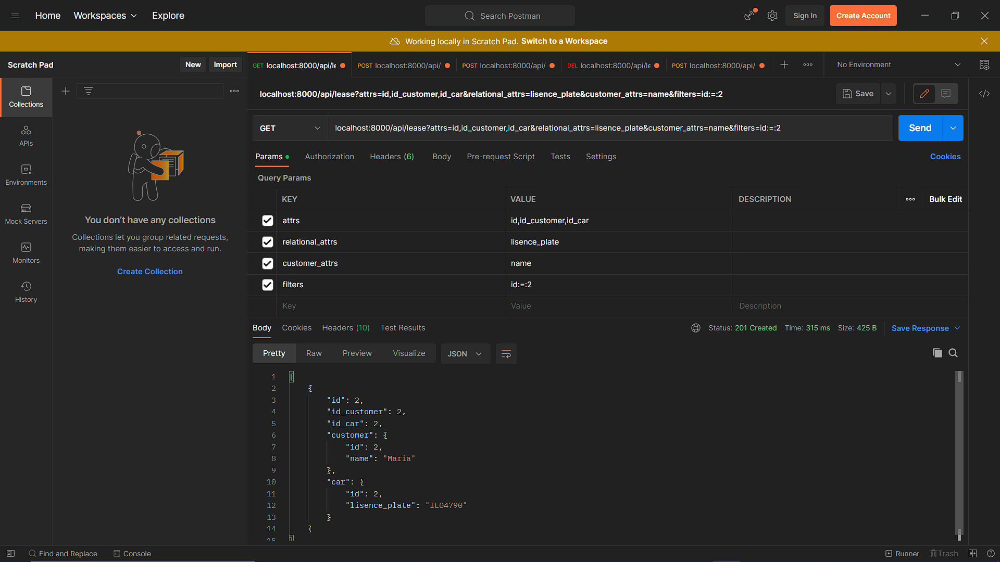
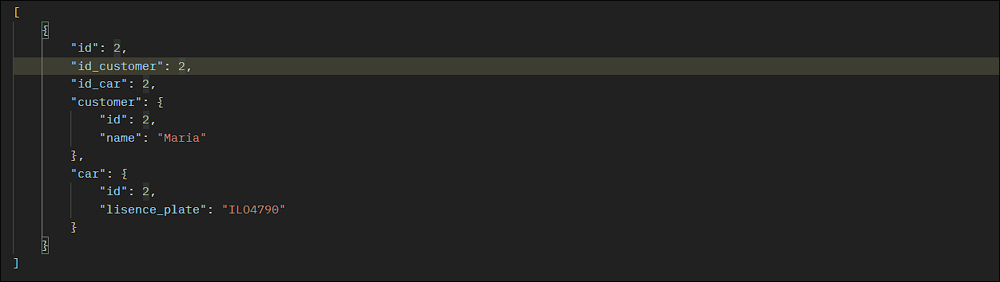

<h1 style="text-align: center; color: red;">App Rental Car</h1>

<h2 style="text-align: center; color: black;">Introduction</h2>

The original source of this project is from a <a href="https://www.udemy.com/course/curso-completo-do-desenvolvedor-laravel/learn/lecture/24396380?start=225#overview">PHP/Laravel development</a> course on Udemy, which I made some changes and improvements, Involving relationships between tables and the design pattern repository through the Laravel framework.

 

<h2 style="text-align: center; color: black;">About the project</h2>

This API project consists in a Car Rental System, where data involving customers, cars, brands are related, determining whether a car can be rented or not. It's possible to: insert, show, update and delete datas selecting the HTTP verb  intended for each purpose. Example: GET verb in the endpoint "localhost:8000/api/lease" to search data.

 

<h2 style="text-align: center; color: black;">About the development</h2>

App rental car is developed using the Web Service rest architecture, where the client receives reponses with the data in JSON format. I used the POSTMAN as a client for testing the endpoints of this API.

</img>
 
</img>
 

Above is an example of the API reponse, where a search was made in the database, specifically in the leases tables, filtering by the information passed, which was the search for the id that is equal 2 in this table. It's possible to insert paraments in the request, they represents the attributes that will be shown in response of the given endpoint, such as name, id, Availability, etc.And is implemented the relational attributes, they represents the relational data of another tables that will be shown along with the attributes of the table of current endpoint.

 

In the image, datas are being shown from 2 tables(customers and cars), that are related to the data in the main table of the requested endpoint(lease). I used the Design Pattern Repository to prevent the code from repeating itself in each controller to implement the relationships through the attributes.

